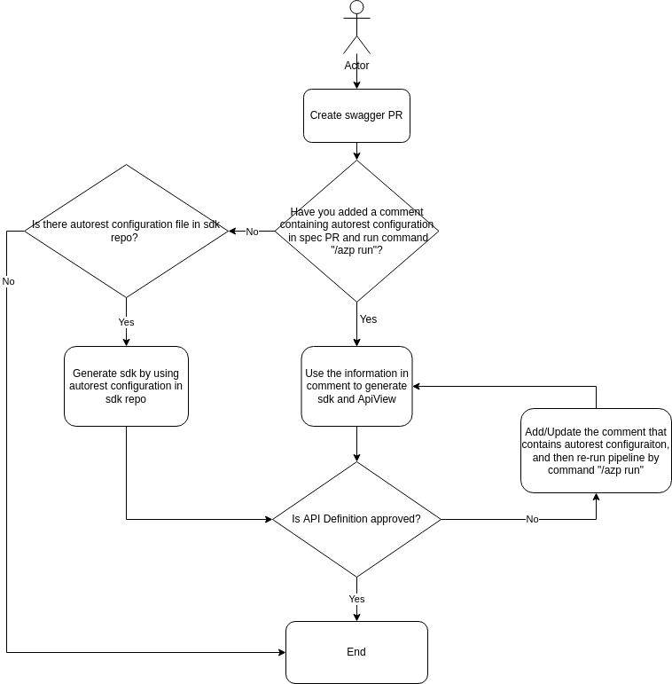

# Service Onboard DPG with Swagger CI Pipeline

Service Onboarding DPG with Swagger CI pipeline can help you get generated SDK and ApiView during the procedure of creating swagger PR.
The benefits are following:
1. API signature could be reviewed at the same time when we submit a Swagger PR. This could help to detect API issues at the early stage.
2. It enable service teams to access their SDKs even before their Swagger PR is merged.

This Document describes the process of how to onboard DPG with SDK automation pipeline. __This document is targeting for service team.__ 

*If you want to go through details of pipeline implementation, please go to [Integrate DPG and ApiView in SDK Automation Pipeline](Integrate-dpg-and-apiview-in-sdk-automation-pipeline.md).*

## WorkFlow

__Description:__
1. Creates a swagger PR with [Guide to design and creation of Data Plane REST API and Client Libraries](https://aka.ms/azsdk/dpcodegen).
2. If the SDK was generated for this service before , please go to step 4. Otherwise, this is a new service and please go to step 3.
3. Create branch with name `dpg/<prNumber>` in sdk repository, and add autorest configuration file. Then add a comment `/azp run` in swagger PR.
   1. `<prNumber>` is the PR number of swagger PR.
   2. Please refer to [Add autorest configuration file in sdk repository](./add-autorest-configuration-file-in-sdk-repository.md) on how to add autorest configuration files.
4. Swagger PR CI generates SDK and ApiView automatically, and you can find them in swagger PR comments.
5.  Please refer to the [Guide of Reviewing the Api Design/Definition](https://dev.azure.com/azure-sdk/internal/_wiki/wikis/internal.wiki/591/Guide-to-design-and-creation-of-Data-Plane-REST-API-and-Client-Libraries?anchor=ii.-review-the-api-design/definition) to reivew API definition.
6. If Arch Board approves the ApiView, go to step 10. Otherwise, go to step 7.
7. Update Swagger if needed.
8. Update autorest configuration file if needed. Here, if there is a branch named `dpg/<prNumber>` in sdk repository, please update it in the branch. Otherwise, create a branch named `dpg/<prNumber>` from `main` branch in sdk repository and update the `autorest.md` or `README.md` in the new created branch.
9. Add a comment `/azp run` in swagger PR, and go to step 4.
10. Get the generated SDK and ApiView from swagger PR comment. If we want to make manual changes in the generated sdk, please refer to [Next Steps After Generating Codes](./next-steps-after-generating-codes.md).

## FAQ
1. I don't have permission to create branch in sdk repository. Who can I ask for help?
    
    __Answer__: Please ask sdk owners for help with email: azsdk-dpgsupport@microsoft.com.
   
2. What should I do when I encounter error in generating SDK in swagger PR CI pipeline?
   
    __Answer__: Please check the comment [Swagger Generation Artifacts] and the error message of failed pipeline. If you find the error messages ask you to fix `autorest.md`/`README.md`/swagger, please fix it. If you cannot understand error message, please ask sdk owners for help with mail: azsdk-dpgsupport@microsoft.com.

3. Do I need to delete the branch `dpg/<prNumber>` in sdk repository?

    __Answer__: It's up to you. You can delete it. If you don't delete it, there will be a scheduler job to delete it.